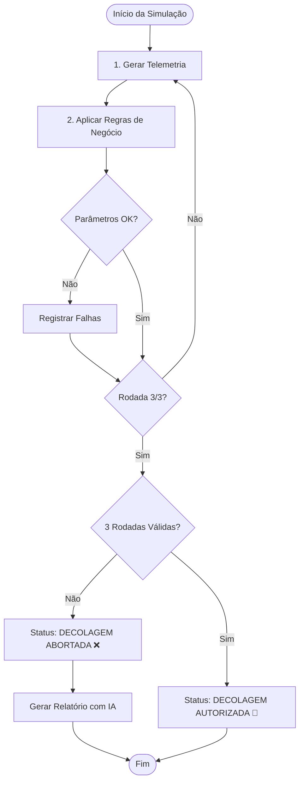

# 🚀 Missão Aurora Siger - Sistema de Telemetria e Decisão de Voo


Este repositório contém a documentação e o protótipo do sistema de telemetria da nave **Aurora**. O projeto integra conceitos de Ciência da Computação, Engenharia de Foguetes e Meteorologia para validar a segurança de janelas de lançamento aeroespacial.

O projeto culmina em um script Python que atua como uma camada de Inteligência de Voo, automatizando a decisão de Lançar ou Abortar com base em telemetria simulada e regras de negócio, considerando não apenas aspectos técnicos, mas também custo e impacto social da exploração espacial. 

<br>


## 📋 Visão Geral
Este repositório contém:

* Um protótipo de simulação de telemetria com regras de segurança.

* Um módulo de análise com IA (Gemini) que age como um “Diretor de Voo” virtual.

<br>

## 🎯 Objetivos do Projeto
* **Simulação de telemetria:** Geração de dados aleatórios para parâmetros críticos do foguete (temperatura, pressão, energia, integridade, módulos críticos).
* **Verificação de segurança:** Execução de uma sequência de 3 testes pré-lançamento, validando a telemetria contra regras de negócio pré-definidas.
* **Relatórios detalhados no console:** Exibição de relatórios claros para cada rodada, indicando sucesso ou falhas e listando as anomalias detectadas.
* **Análise com IA (Gemini):** Em caso de falha, chamada à API do Gemini para gerar um relatório técnico estruturado, explicando as anomalias e sugerindo ações para a equipe de engenharia.

<br>

### **Parâmetros Monitorados**
Durante a simulação, a camada de telemetria monitora:
* **🌡️ Temperatura:** interna e externa da nave.
* **🏗️ Estrutural:** status de integridade da fuselagem e célula da nave.
* **⚡Energia:** capacidade e carga disponível (%) para sistemas essenciais.
* **🎈 Pressão:** monitoramento dos tanques (faixa operacional segura).
* **💻 Módulos Críticos:** status dos sistemas essenciais de bordo.

<br>

## ⚖️ Regras de Negócio de Segurança
Para que a decolagem seja autorizada, todos os critérios abaixo devem ser satisfeitos em 3 rodadas consecutivas:
* **Integridade Estrutural:** deve ser 1 (Operacional).
* **Energia:** mínimo de 80% para decolagem segura.
* **Pressão:** entre 300 e 450 psi.
* **Temperatura Interna:** entre 18°C e 25°C.
* **Módulos Críticos:** todos com status "OK".

Se qualquer uma dessas condições falhar em uma rodada, o teste é marcado como FALHA, e a missão é abortada ao final da sequência, com emissão de relatório técnico da IA.

<br>

### 🚀 Exemplo de Saída no Console
<details>
<summary>Clique para ver um exemplo de relatório em caso de falha nas três rodadas de teste</summary>

```text

=====================================================================================
              Sejam bem-vindos ao sistema de telemetria da MISSÃO AURORA             
                   Iniciando sequência de 3 testes obrigatórios...                   
=====================================================================================
-------------------------------------------------------------------------------------
|                              RELATÓRIO DE RODADA: 1/3                             |
|                                                                                   |
| TESTE FALHOU                                                                      |
| Rodada 1: Anomalias detectadas.                                                   |
| -------------------------------------------------------------                     |
| VERIFICAÇÃO DE SEGURANÇA:                                                         |
|   > Bateria Útil p/ Sistema: 3039.19 kWh                                          |
|   > Custo de Decolagem.....: 463.78 kWh                                           |
|   > Autonomia energética pós decolagem...: 67.83%                                 |
|   > Temp. Interna: 13.08 C°                                                       |
|   > Temp. Externa: -7.10 C°                                                       |
|   > Integridade: OK                                                               |
|   > Pressão: 422.22 psi                                                           |
| -----------------------------------------------------------------                 |
| ERROS ENCONTRADOS:                                                                |
| - FALHA NA INTEGRIDADE ESTRUTURAL                                                 |
| - Temperatura interna fora do padrão: 13.08 C°                                    |
| - Temperatura externa fora do padrão: -7.10 C°                                    |
| - FALHA NOS MÓDULOS CRÍTICOS                                                      |
| - RISCO DE BLACKOUT: Saldo de 67.83% (Min: 80%)                                   |
|                                                                                   |
-------------------------------------------------------------------------------------
-------------------------------------------------------------------------------------
|                              RELATÓRIO DE RODADA: 2/3                             |
|                                                                                   |
| TESTE FALHOU                                                                      |
| Rodada 2: Anomalias detectadas.                                                   |
| -------------------------------------------------------------                     |
| VERIFICAÇÃO DE SEGURANÇA:                                                         |
|   > Bateria Útil p/ Sistema: 112.89 kWh                                           |
|   > Custo de Decolagem.....: 396.91 kWh                                           |
|   > Autonomia energética pós decolagem...: 6.28%                                  |
|   > Temp. Interna: 19.40 C°                                                       |
|   > Temp. Externa: 6.11 C°                                                        |
|   > Integridade: OK                                                               |
|   > Pressão: 463.72 psi                                                           |
| -----------------------------------------------------------------                 |
| ERROS ENCONTRADOS:                                                                |
| - FALHA NA INTEGRIDADE ESTRUTURAL                                                 |
| - Pressão fora dos padrões: 463.72 psi                                            |
| - RISCO DE BLACKOUT: Saldo de 6.28% (Min: 80%)                                    |
|                                                                                   |
-------------------------------------------------------------------------------------
-------------------------------------------------------------------------------------
|                              RELATÓRIO DE RODADA: 3/3                             |
|                                                                                   |
| TESTE FALHOU                                                                      |
| Rodada 3: Anomalias detectadas.                                                   |
| -------------------------------------------------------------                     |
| VERIFICAÇÃO DE SEGURANÇA:                                                         |
|   > Bateria Útil p/ Sistema: 1066.13 kWh                                          |
|   > Custo de Decolagem.....: 284.43 kWh                                           |
|   > Autonomia energética pós decolagem...: 45.58%                                 |
|   > Temp. Interna: 16.35 C°                                                       |
|   > Temp. Externa: 18.20 C°                                                       |
|   > Integridade: OK                                                               |
|   > Pressão: 384.69 psi                                                           |
| -----------------------------------------------------------------                 |
| ERROS ENCONTRADOS:                                                                |
| - FALHA NA INTEGRIDADE ESTRUTURAL                                                 |
| - Temperatura interna fora do padrão: 16.35 C°                                    |
| - FALHA NOS MÓDULOS CRÍTICOS                                                      |
| - RISCO DE BLACKOUT: Saldo de 45.58% (Min: 80%)                                   |
|                                                                                   |
-------------------------------------------------------------------------------------
=================================================================
RELATÓRIO DE RODADA: 0 Sucessos | 3 Falhas
STATUS: ABORTAR MISSÃO! Verifique os erros acima. 🛑

>>> STATUS FINAL: DECOLAGEM ABORTADA! ❌
A missão requer 3 sucessos consecutivos. Detectamos 3 falha(s).
18:35:44 - A equipe de engenharia está investigando as falhas.

--- ANÁLISE DO DIRETOR DE VOO (IA) ---
**BOLETIM TÉCNICO DE DIAGNÓSTICO – ABORTO DE LANÇAMENTO DA MISSÃO AURORA**

**CLASSIFICAÇÃO DOS DADOS:**

1.  **Integridade Estrutural/Mecânica:**
    *   FALHA NA INTEGRIDADE ESTRUTURAL
    *   Pressão fora dos padrões: 463.72 psi (Indica falha em sistema pressurizado ou vedação)
2.  **Sistemas Críticos/Funcionais:**
    *   FALHA NOS MÓDULOS CRÍTICOS
3.  **Subsistema Elétrico/Energia:**
    *   RISCO DE BLACKOUT: Saldo de 45.58% (Min: 80%)
    *   RISCO DE BLACKOUT: Saldo de 6.28% (Min: 80%)
    *   RISCO DE BLACKOUT: Saldo de 67.83% (Min: 80%)
4.  **Condições Ambientais/Térmicas:**
    *   Temperatura externa fora do padrão: -7.10 C°
    *   Temperatura interna fora do padrão: 13.08 C°
    *   Temperatura interna fora do padrão: 16.35 C°

---

**BOLETIM TÉCNICO DE DIAGNÓSTICO**

**STATUS:**
O lançamento da Missão Aurora foi imediatamente abortado. As verificações pré-lançamento indicaram falhas críticas em 3 de 3 testes, confirmando uma condição NO-GO.

**RISCO:**
O conjunto de anomalias registradas, isoladamente e em conjunto, cria um cenário de risco inaceitável de perda do veículo e da missão.
*   **Falha na Integridade Estrutural e Pressão Anormal:** Indica comprometimento físico da estrutura do veículo ou de seus subsistemas de propulsão/pressurização. Este cenário representa um risco iminente de desintegração catastrófica, explosão ou falha estrutural durante as fases de maior estresse dinâmico do voo, culminando na perda total do veículo e da carga útil.
*   **Falha nos Módulos Críticos:** Aponta para a inoperância ou desempenho degradado de componentes essenciais para controle de voo, navegação, telemetria, sistemas de segurança ou propulsão. A falha de qualquer um desses módulos pode levar à perda de controle da trajetória, incapacidade de executar comandos, falha na separação de estágios ou impossibilidade de abortar a missão de forma segura, resultando na perda do veículo.
*   **Múltiplos Riscos de Blackout:** Com saldos de energia muito abaixo do mínimo operacional exigido (45.58%, 6.28%, 67.83% frente a 80%), este é um indicativo claro de uma falha sistêmica e crítica no subsistema elétrico. A incapacidade de sustentar a alimentação de energia levaria à paralisação de todos os sistemas aviônicos e de suporte à vida a bordo, resultando em perda completa de controle, comunicação e, consequentemente, a perda do veículo em qualquer fase do voo.
*   **Temperaturas Internas e Externas Fora do Padrão:** Sugerem um ambiente operacional inadequado para os equipamentos. Temperaturas extremas podem causar falha eletrônica por superaquecimento ou congelamento, degradação de materiais, comprometimento da lubrificação de componentes mecânicos ou falha de isolamento, afetando diretamente a funcionalidade e estabilidade do veículo. A temperatura externa anormal também pode indicar condições climáticas impróprias ou falha nos sistemas de controle térmico do veículo.

**AÇÃO:**
1.  **Engenharia de Hardware:** Foco imediato na inspeção detalhada e diagnóstica das falhas estruturais, dos módulos críticos e do subsistema de pressurização/propulsão. Uma análise aprofundada da arquitetura elétrica e das baterias é imperativa para identificar a raiz dos múltiplos riscos de blackout. É crucial verificar os sensores e sistemas de controle térmico, bem como as condições ambientais da plataforma de lançamento.
2.  **Engenharia de Software:** Auditoria completa dos algoritmos de monitoramento e telemetria para garantir a precisão e robustez dos dados reportados. Revisão dos parâmetros de pré-lançamento e protocolos de verificação para identificar possíveis lacunas que permitiram a progressão a um estado de falha tão crítico. Desenvolver e testar atualizações de software para incorporar novas lógicas de detecção e mitigação baseadas nas descobertas de hardware.
=================================================================
```
</details>

<br>

## 🏗️ Arquitetura e Fluxo de Decisão

Em alto nível, o sistema segue o fluxo:

1. **Geração de telemetria simulada** (valores aleatórios dentro/fora dos limites).

2. **Aplicação das regras de negócio** para cada rodada de teste.

3. **Cálculo do status da missão** (GO / NO-GO) após 3 rodadas.

4. **Em caso de falha**:

    * Registro das anomalias por rodada.

    * Geração de relatório técnico com IA (Gemini).

<br>

### 🧭 Fluxo de Decisão da Missão

<br>

## 🛠️ Configuração e Instalação
Siga os passos abaixo para configurar e executar o projeto em seu ambiente local.

### Pré-requisitos
- [Python 3.9+](https://www.python.org/downloads/)
- Chave de API do [Google AI Studio (Gemini)](https://aistudio.google.com/app/apikey)
<br>

### Passos para Execução
1.  **Clone o repositório:**
    ```bash
    git clone https://github.com/seu-usuario/PBL-Aurora.git
    cd PBL-Aurora
    ```

2.  **Crie e ative um ambiente virtual:**
    ```bash
    # Para Windows
    python -m venv venv
    .\venv\Scripts\activate

    # Para macOS/Linux
    python3 -m venv venv
    source venv/bin/activate
    ```

3.  **Instale as dependências:**
    O projeto utiliza um arquivo `requirements.txt` para gerenciar as bibliotecas.
    ```bash
    pip install -r requirements.txt
    ```

4.  **Configure as variáveis de ambiente:**
    - Crie um arquivo chamado `.env` na raiz do projeto.
    - Adicione sua chave da API do Gemini, como no exemplo abaixo:
    ```
    GEMINI_API_KEY="SUA_CHAVE_DE_API_AQUI"
    ```
    <br>     

### Executando a Simulação

O projeto possui duas saídas principais: uma simulação via console e uma interface web em desenvolvimento.

- **Para rodar a simulação no console:**
  ```bash
  python codigo/main.py
  ```
  Isso irá:
    * Executar os 3 testes de telemetria
    * Exibir os relatórios de cada rodada no terminal 
    * Gerar, em caso de falha, um relatório detalhado via IA (Gemini).

<br> 

## 📂 Estrutura do Projeto
```
PBL-Aurora/
├── .env                        # Chave de segurança 
├── .gitignore                  # Regras de exclusão do Git
├── requirements.txt            # Dependências do projeto
├── codigo/
│   └── Projeto_Aurora.ipynb    # código
└── README.md                   # Documentação do projeto
```

<br>

# REFLEXÃO CRÍTICA: MISSÃO AURORA
A exploração espacial é o reflexo dos valores da humanidade. Na Missão Aurora, a telemetria não apenas monitora máquinas, mas protege vidas e fundamenta uma presença humana ética e consciente.

### ⚖️ Ética e Responsabilidade
A exploração espacial não é uma fuga dos problemas terrestres, mas uma busca por soluções globais. O espaço deve ser um bem comum, focado na ciência e na cooperação, evitando a militarização e garantindo que o progresso tecnológico beneficie toda a sociedade, não apenas grupos restritos.

### 🛰️ Sustentabilidade e Lixo Espacial
A órbita terrestre é um recurso finito. Para evitar o Efeito Kessler (colisões em cadeia), a missão adota protocolos de Desórbita Programada: cada componente possui um fim de ciclo planejado, garantindo que a "estrada espacial" permaneça limpa e segura para as futuras gerações.

### 🤝 Impacto Social do Lançamento Tripulado
Enviar seres humanos ao espaço gera transformações profundas na estrutura social:

* Inspiração STEM: O "Efeito Apollo" atrai jovens para carreiras científicas e quebra barreiras sociais através da representatividade.

* Diplomacia Global: A manutenção da vida em órbita exige cooperação internacional, promovendo o diálogo e reforçando a identidade planetária (Overview Effect).

* Avanços na Medicina: A telemetria e o suporte à vida impulsionam a telemedicina, cirurgias robóticas e tratamentos de perda óssea/muscular para idosos na Terra.

* Cultura de Segurança: Os rigorosos protocolos de falha zero e as tecnologias de reciclagem de recursos (água e ar) são aplicados hoje em indústrias críticas e na gestão de desastres ambientais.
--- 
**Conclusão:** Decolar exige mais que combustível; exige o compromisso de proteger quem parte, quem fica e o ambiente que nos cerca.
  
<br>

## 👥 Equipe (FIAP 2026)
| Nome | RM |
| :--- | :--- |
| **Juan de Lucas Frois** | RM563260 |
| **Flávia Roberta Pennachin** | RM561860 |
| **Pedro Valente Toledo** | RM570394 |
| **Bruno Antonio Santos Silva** | RM573180 | 
| **Renan Mano Otero** | RM573615 |

<br>

---
**Instituição:** FIAP\
**Ano:** 2026\
**Turma:** 1CCOA-2026  
