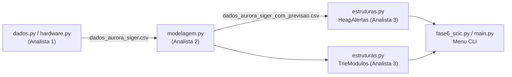
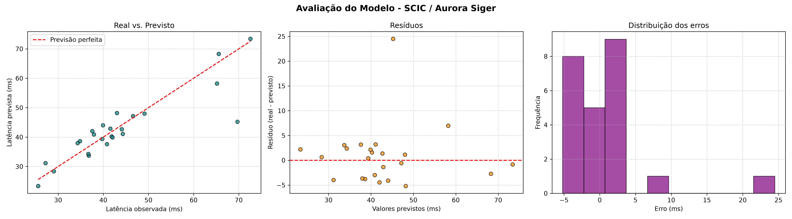

# Relatório Técnico — Fase 6: SCIC (Sistema Computacional Integrado da Colônia)

**Missão Aurora Siger · FIAP · 1CCOA-2026**
Equipe: Juan de Lucas Frois (RM563260) · Flávia Roberta Pennachin (RM561860) · Pedro Valente Toledo (RM570394)

---

## 1. Contexto

Após o pouso (Fase 2), a estabilização energética (Fase 3), a montagem da rede de infraestrutura (Fase 4) e o núcleo cognitivo (Fase 5), a colônia Aurora Siger precisa de um **sistema computacional integrado** capaz de:

1. coletar e validar a telemetria elétrica e de comunicação dos 8 módulos da base;
2. **prever a latência** de comunicação de cada módulo e medir o quanto a previsão erra;
3. **priorizar alertas** de forma que o problema mais grave seja tratado primeiro;
4. **localizar rapidamente** módulos, sensores e comandos durante uma operação.

O SCIC une esses quatro pontos num pipeline único:



## 2. Base de dados e eletricidade básica (Analista 1)

- **Arquivo:** `data/processed/dados_aurora_siger.csv` — 120 registros (15 ciclos × 8 módulos), 20 colunas, semente fixa (`42`) para reprodutibilidade.
- **Colunas-chave:** `modulo_id`, `nome_modulo`, `tipo_modulo`, `essencial`, `codigo_sensor_hex`, `tensao_v`, `corrente_a`, `potencia_w`, `limite_potencia_w`, `latencia_observada_ms`, `latencia_prevista_ms`, `status_operacional`, `prioridade`, `mensagem_alerta`.
- **Potência elétrica:** $P = V \times I$ (`hardware.calcular_potencia`). Tensões de 220–240 V e correntes de 5–30 A resultam em potências de ~1,1 kW a ~7,2 kW. Quando $P$ ultrapassa o `limite_potencia_w` do módulo, o registro vira alerta de **sobrecarga no barramento**.
- **Lei de Ohm:** $R = V / I$ (`hardware.calcular_resistencia`) e `diagnosticar_circuito` apontam sobrecarga térmica.
- **Bases numéricas (COA):** cada sensor tem um código hexadecimal (ex.: `0x2A`). A conversão `0x2A → 42 (decimal) → 00101010 (binário, 8 bits)` emula a leitura de um registrador do hardware embarcado (`decodificar_registrador_telemetria`).
- **Limpeza/validação:** padronização de status, remoção de duplicados e nulos, checagem de faixas físicas e verificação de que `potencia_w ≈ tensao_v × corrente_a` (tolerância de 0,01 W, por causa do arredondamento em ponto flutuante).

## 3. Modelagem, erros e métricas (Analista 2)

- **Erro absoluto:** $EA = |y - \hat{y}|$ (em ms). **Erro relativo:** $ER = |y - \hat{y}| / |y|$.
  Critério: $ER < 5\%$ aceitável · $5\% \le ER < 15\%$ atenção · $ER \ge 15\%$ preocupante.
- **Ponto flutuante (IEEE 754):** `0.1 + 0.2 == 0.3` é `False` (resultado `0.30000000000000004`); somar 0,1 dez vezes acumula erro de ~1,1·10⁻¹⁶. Por isso comparações usam tolerância (`np.isclose`) e diferenças nessa ordem são ruído de representação, não erro do modelo.
- **Modelo:** Regressão Linear (scikit-learn), *features* elétricas/ambientais + `prioridade` + `tipo_modulo` (One-Hot), divisão 80/20 e validação cruzada de 5 partes.

| Métrica | Treino | Teste |
|---|---|---|
| MAE (ms) | 3,019 | 3,601 |
| MSE (ms²) | 21,939 | 34,418 |
| RMSE (ms) | 4,684 | 5,867 |
| R² | 0,885 | 0,776 |
| RMSE / MAE | 1,55 | 1,63 |

RMSE médio da validação cruzada: **5,75 ms**.

**Interpretação.**
- **MAE vs RMSE:** o RMSE eleva cada erro ao quadrado antes da média, então é mais sensível a *outliers*. Como RMSE/MAE ≈ 1,6, há poucos registros com erro grande: são os **picos de latência** (6% das leituras) que o modelo não tem como prever — erro máximo de 24,49 ms.
- **R² = 0,78** no teste: o modelo explica ~78% da variação da latência. A queda de 0,885 → 0,776 indica leve *overfitting* (96 amostras de treino para 14 variáveis).
- **Erros no teste:** EA médio 3,60 ms (mediana 2,85 ms); ER médio 7,92%; 37,5% aceitável, 58,3% atenção, 4,2% preocupante.

Saídas: `graficos_ou_imagens/avaliacao_modelo_scic.png` (real × previsto, resíduos, histograma) e `erro_relativo_por_modulo.png`, além de `dados_aurora_siger_com_previsao.csv` (com `erro_relativo_pct` e `faixa_erro`), que alimenta o Heap.



## 4. Estruturas de dados avançadas (Analista 3)

Código: `src/fase6_scic/estruturas.py` · Testes: `tests/test_estruturas.py` (6 testes, todos passando).

### 4.1 `HeapAlertas` — fila de prioridade para alertas críticos

**Problema:** a cada ciclo chegam alertas de vários módulos. O operador precisa sempre do **mais urgente** primeiro, e novos alertas continuam chegando enquanto os antigos são atendidos.

**Implementação:** *max-heap* binário implementado à mão sobre uma lista (sem usar `heapq`, para deixar explícitos o *sift-up* e o *sift-down*). O nó `i` tem filhos `2i+1` e `2i+2`; todo pai tem criticidade ≥ à dos filhos, então o alerta mais grave fica sempre na raiz. Em caso de empate, sai primeiro o **mais antigo**, para nenhum alerta ficar esquecido na fila (*starvation*).

**Quem entra na fila:** registros com `status_operacional == "alerta"`, com **sobrecarga** (`potencia_w > limite_potencia_w`) ou com erro de previsão **PREOCUPANTE**. Na base atual: **28 alertas** de 120 registros.

**Pontuação de criticidade** (regra transparente, cada parcela vira um "motivo" exibido ao operador):

| Fator | Pontos |
|---|---|
| Status `alerta` / `manutencao` | 40 / 10 |
| Sobrecarga de potência / Radiação elevada / Latência acima do previsto | 30 / 25 / 20 |
| Faixa de erro do modelo PREOCUPANTE / ATENÇÃO | 20 / 8 |
| Módulo essencial (suporte à vida, comunicação, controle) | 15 |
| Prioridade (1–4) | 5 × prioridade |
| Excesso de potência acima do limite | +1 por 1% |
| Latência observada acima da prevista | +0,5 por 1% (teto 40) |

**Top 3 da execução:** (1) Controle de Missão, ciclo 15 — latência 71,9% acima da prevista [146,0]; (2) Produção de Oxigênio, ciclo 6 [137,1]; (3) Suporte Médico, ciclo 13 [135,9]. Os três são módulos essenciais, com erro de previsão PREOCUPANTE.

**Complexidade e justificativa:**

| Operação | Lista não ordenada | Lista ordenada | **Heap** |
|---|---|---|---|
| Inserir alerta | O(1) | O(n) | **O(log n)** |
| Extrair o mais crítico | O(n) | O(1) | **O(log n)** |
| Consultar o topo | O(n) | O(1) | **O(1)** |
| Processar n alertas (inserir + extrair todos) | O(n²) | O(n²) | **O(n log n)** |

A lista é rápida em uma operação e lenta na outra. O heap é bom nas duas, que é o que importa com telemetria contínua.

**Benchmark** (`comparar_heap_vs_lista`, inserir n e extrair todos em ordem):

| n | Lista (ms) | Heap (ms) | Ganho |
|---|---|---|---|
| 500 | 3,88 | 3,46 | 1,1× |
| 2 000 | 70,89 | 17,95 | 4,0× |
| 5 000 | 468,28 | 53,40 | 8,8× |

Com n pequeno a lista empata, porque as constantes pesam mais que a complexidade. Mas a diferença cresce junto com n, como a análise assintótica prevê: multiplicar n por 10 multiplicou o tempo da lista por ~120 (≈ quadrático) e o do heap por ~15 (≈ n log n).

### 4.2 `TrieModulos` — busca por prefixo

**Problema:** durante uma emergência, o operador digita só o começo do nome ("com", "oxi", "0x2") e precisa achar o módulo, o sensor ou o comando na hora.

**Implementação:** árvore de prefixos em que cada aresta é um caractere. As chaves são **normalizadas** (minúsculas, sem acento), então `com`, `Com` e `comunicação` levam todas a *Comunicação Central*. Cada módulo é indexado por várias chaves: nome completo, cada palavra do nome (`central`), `modulo_id` (`mod-02`), `tipo_modulo` e seus códigos hex. Os comandos do sistema (`/alertas`, `/diagnosticar`...) também entram. São **62 chaves** no total.

| Consulta | Resultado |
|---|---|
| `com` | MOD-02 – Comunicação Central |
| `0x2` | sensores 0x2A (dec 42, bin 00101010) e 0x2B (dec 43) |
| `mod-0` | os 8 módulos |
| `su` | MOD-05 – Suporte Médico |
| `di` | comando `/diagnosticar` |

**Complexidade:** inserir e buscar exato custam O(m), com m = tamanho da chave. A busca por prefixo custa O(m + k), com k = tamanho da subárvore de respostas. Esse custo **não depende do número total de módulos**. Já numa lista, cada consulta compara o prefixo com todas as n chaves (O(n·m)).

## 5. Gestão inteligente da rede: IoT, telemetria e manutenção preditiva

- **Telemetria/IoT:** cada módulo funciona como um nó IoT. Ele publica a cada ciclo leituras de tensão, corrente, temperatura, pressão, radiação e latência, identificadas pelo código hex do sensor. Na Terra o equivalente seria MQTT/LoRa. Na colônia, os pacotes passam pela rede de grafos da Fase 4.
- **Redes inteligentes (*smart grid*):** com $P = V \times I$ calculado em tempo real e comparado ao limite de cada barramento, dá para prever sobrecargas e redistribuir carga entre os módulos antes de um desligamento, aproveitando as rotas mínimas da Fase 4.
- **Manutenção preditiva:** o modelo de regressão dá a latência **esperada**. Quando a observada se afasta muito dela (faixa PREOCUPANTE), o equipamento está se comportando fora do padrão, o que pode indicar degradação de antena, cabo ou fonte. Esse desvio entra no Heap e gera uma ordem de manutenção **antes** da falha. Assim a colônia sai da manutenção corretiva e passa para a preditiva, economizando peças, energia e horas de trabalho, que são os recursos mais escassos em Marte.
- **Escalabilidade:** com mais módulos e sensores, o Heap (O(log n)) e a Trie (O(m + k)) mantêm o tempo de resposta adequado para operação em tempo real.

## 6. Reflexão social, cultural e sustentável

- **Decisão automatizada com responsabilidade:** o SCIC **prioriza**, mas não decide sozinho. A tela de atendimento diz explicitamente que a decisão final é do operador humano. Cada pontuação mostra seus **motivos**, para que a equipe possa auditar e contestar a ordem da fila. Um sistema que manda desligar o suporte médico sem explicar por que não é aceitável numa comunidade isolada.
- **Vieses dos pesos:** os pesos da criticidade são uma escolha de valor. Dar mais peso a módulos "essenciais" significa, na prática, que alguns grupos de trabalho (laboratório, agricultura) esperam mais. Essa regra precisa ser discutida com toda a colônia e revista periodicamente, não ficar escondida no código.
- **Limites do modelo:** R² = 0,78 quer dizer que ~22% da variação não é explicada. Picos de latência fora do padrão aparecem como erro grande, não como previsão. Por isso o modelo serve de apoio e não pode ser tratado como verdade absoluta.
- **Diversidade e acessibilidade:** a busca da Trie ignora acentos e maiúsculas, o que facilita o uso por tripulantes de línguas e teclados diferentes e por quem está sob estresse. Os códigos hex e os comandos dão uma linguagem comum, independente do idioma.
- **Cultura e trabalho:** automatizar a triagem reduz a carga cognitiva das equipes em turnos longos. Em contrapartida, exige treino para que as pessoas entendam o sistema e não percam a habilidade de operar sem ele, caso o computador falhe.
- **Sustentabilidade:** detectar sobrecargas e prever falhas evita queimar componentes que não podem ser repostos e reduz o desperdício de energia. Estruturas eficientes (O(log n) em vez de O(n)) também consomem menos processamento, e portanto menos energia, num ambiente em que cada watt conta.

## 7. Como executar

```bash
# Orquestrador independente da Fase 6 (menu interativo)
python -m src.fase6_scic.fase6_scic

# Pipeline completo sem menu
python -m src.fase6_scic.fase6_scic --auto

# Pelo orquestrador geral (Fase 6 → opções 4 a 7)
python main.py

# Testes das estruturas
pytest tests/test_estruturas.py
```

## 8. Conclusão

O SCIC fecha o ciclo da missão: os dados elétricos e de comunicação são coletados e validados, um modelo estatístico estima o comportamento esperado da rede e mede os próprios erros, e duas estruturas de dados avançadas transformam esses números em ação. O Heap decide **o que atender primeiro** e a Trie mostra **onde está** cada recurso. Tudo isso com decisões explicáveis e supervisão humana.
